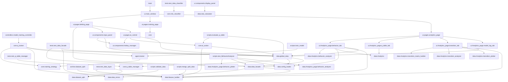

# 專案名稱：練習用的ai 訓練互動工具

## 專案簡介
一套使用 Q-learning 強化學習技術，結合 PySide6 UI 開發的遊戲下注決策系統。

## 系統架構
- Q-learning 模型訓練與推論
- 白名單策略與信心值策略
- 多功能 UI 面板（下注、AI控制、資料分析、訓練管理）

# 測試

test

```mermaid
graph TD
  main["main"] --> ui_main_window["ui.main_window"]
  data_data_facade["data.data_facade"] --> data_feature_builder["data.feature_builder"]
  data_data_facade["data.data_facade"] --> data_data_errors["data.data_errors"]
  data_global_data["data.global_data"] --> data_data_facade["data.data_facade"]
  data_global_data["data.global_data"] --> data_config_loader["data.config_loader"]
  data_global_data["data.global_data"] --> core_q_table_manager["core.q_table_manager"]
  archive_dataset_split["archive.dataset_split"] --> data_feature_builder["data.feature_builder"]
  controllers_model_training_controller["controllers.model_training_controller"] --> core_q_trainer["core.q_trainer"]
  tests_test_data_facade["tests.test_data_facade"] --> data_global_data["data.global_data"]
  tests_test_data_facade["tests.test_data_facade"] --> data_data_errors["data.data_errors"]
  tests_test_data_facade["tests.test_data_facade"] --> data_data_facade["data.data_facade"]
  tests_test_data_layer["tests.test_data_layer"] --> data_dataset_split["data.dataset_split"]
  tests_test_data_layer["tests.test_data_layer"] --> data_feature_builder["data.feature_builder"]
  tests_test_data_classifier["tests.test_data_classifier"] --> core_risk_classifier["core.risk_classifier"]
  tests_test_q_table_manager["tests.test_q_table_manager"] --> core_q_table_manager["core.q_table_manager"]
  core_q_trainer["core.q_trainer"] --> data_global_data["data.global_data"]
  core_q_trainer["core.q_trainer"] --> agent_trainer["agent.trainer"]
  core_q_trainer["core.q_trainer"] --> data_feature_builder["data.feature_builder"]
  core_q_trainer["core.q_trainer"] --> core_training_strategy["core.training_strategy"]
  core_ai_action["core.ai_action"] --> data_global_data["data.global_data"]
  core_ai_action["core.ai_action"] --> data_feature_builder["data.feature_builder"]
  agent_trainer["agent.trainer"] --> core_training_strategy["core.training_strategy"]
  ui_main_window["ui.main_window"] --> ui_pages_analytics_page["ui.pages.analytics_page"]
  ui_main_window["ui.main_window"] --> ui_pages_training_page["ui.pages.training_page"]
  ui_main_window["ui.main_window"] --> ui_pages_betting_page["ui.pages.betting_page"]
  ui_components_input_panel["ui.components.input_panel"] --> data_global_data["data.global_data"]
  ui_components_input_panel["ui.components.input_panel"] --> ui_components_hotkey_manager["ui.components.hotkey_manager"]
  ui_components_display_panel["ui.components.display_panel"] --> data_stat_calculator["data.stat_calculator"]
  ui_pages_ai_control["ui.pages.ai_control"] --> data_global_data["data.global_data"]
  ui_pages_ai_control["ui.pages.ai_control"] --> core_ai_action["core.ai_action"]
  ui_pages_ai_control["ui.pages.ai_control"] --> ui_components_hotkey_manager["ui.components.hotkey_manager"]
  ui_pages_analytics_page["ui.pages.analytics_page"] --> ui_Analytics_page_model_log_tab["ui.Analytics_page.model_log_tab"]
  ui_pages_analytics_page["ui.pages.analytics_page"] --> ui_Analytics_page_transition_tab["ui.Analytics_page.transition_tab"]
  ui_pages_analytics_page["ui.pages.analytics_page"] --> ui_Analytics_page_q_table_tab["ui.Analytics_page.q_table_tab"]
  ui_pages_analytics_page["ui.pages.analytics_page"] --> ui_Analytics_page_behavior_tab["ui.Analytics_page.behavior_tab"]
  ui_pages_training_page["ui.pages.training_page"] --> core["core"]
  ui_pages_betting_page["ui.pages.betting_page"] --> ui_pages_ai_control["ui.pages.ai_control"]
  ui_pages_betting_page["ui.pages.betting_page"] --> ui_components_input_panel["ui.components.input_panel"]
  ui_pages_betting_page["ui.pages.betting_page"] --> data_config_loader["data.config_loader"]
  ui_Analytics_page_behavior_tab["ui.Analytics_page.behavior_tab"] --> data_global_data["data.global_data"]
  ui_Analytics_page_behavior_tab["ui.Analytics_page.behavior_tab"] --> data_feature_builder["data.feature_builder"]
  ui_Analytics_page_behavior_tab["ui.Analytics_page.behavior_tab"] --> data_Analytics["data.Analytics"]
  ui_Analytics_page_behavior_tab["ui.Analytics_page.behavior_tab"] --> data_config_loader["data.config_loader"]
  ui_Analytics_page_behavior_tab["ui.Analytics_page.behavior_tab"] --> data_Analytics_behavior_analyzer["data.Analytics.behavior_analyzer"]
  ui_Analytics_page_transition_tab["ui.Analytics_page.transition_tab"] --> data_global_data["data.global_data"]
  ui_Analytics_page_transition_tab["ui.Analytics_page.transition_tab"] --> data_feature_builder["data.feature_builder"]
  ui_Analytics_page_transition_tab["ui.Analytics_page.transition_tab"] --> data_Analytics_transition_plotter["data.Analytics.transition_plotter"]
  ui_Analytics_page_transition_tab["ui.Analytics_page.transition_tab"] --> data_Analytics_transition_analyzer["data.Analytics.transition_analyzer"]
  ui_Analytics_page_transition_tab["ui.Analytics_page.transition_tab"] --> data_Analytics_transition_matrix_builder["data.Analytics.transition_matrix_builder"]
  ui_Analytics_page_q_table_tab["ui.Analytics_page.q_table_tab"] --> data_Analytics["data.Analytics"]
  scripts_validate_data["scripts.validate_data"] --> data_dataset_split["data.dataset_split"]
  scripts_merge_split_data["scripts.merge_split_data"] --> data_feature_builder["data.feature_builder"]
  scripts_test_BehaviorAnalyzer["scripts.test_BehaviorAnalyzer"] --> data_Analytics_page_behavior_analyzer["data.Analytics_page.behavior_analyzer"]
  scripts_test_BehaviorAnalyzer["scripts.test_BehaviorAnalyzer"] --> data_config_loader["data.config_loader"]
  scripts_test_BehaviorAnalyzer["scripts.test_BehaviorAnalyzer"] --> data_data_facade["data.data_facade"]
  scripts_test_BehaviorAnalyzer["scripts.test_BehaviorAnalyzer"] --> data_Analytics_page_behavior_plotter["data.Analytics_page.behavior_plotter"]
  scripts_evaluate_q_table["scripts.evaluate_q_table"] --> data_global_data["data.global_data"]
  scripts_evaluate_q_table["scripts.evaluate_q_table"] --> core_ai_action["core.ai_action"]
  scripts_train_model["scripts.train_model"] --> agent_trainer["agent.trainer"]
```
